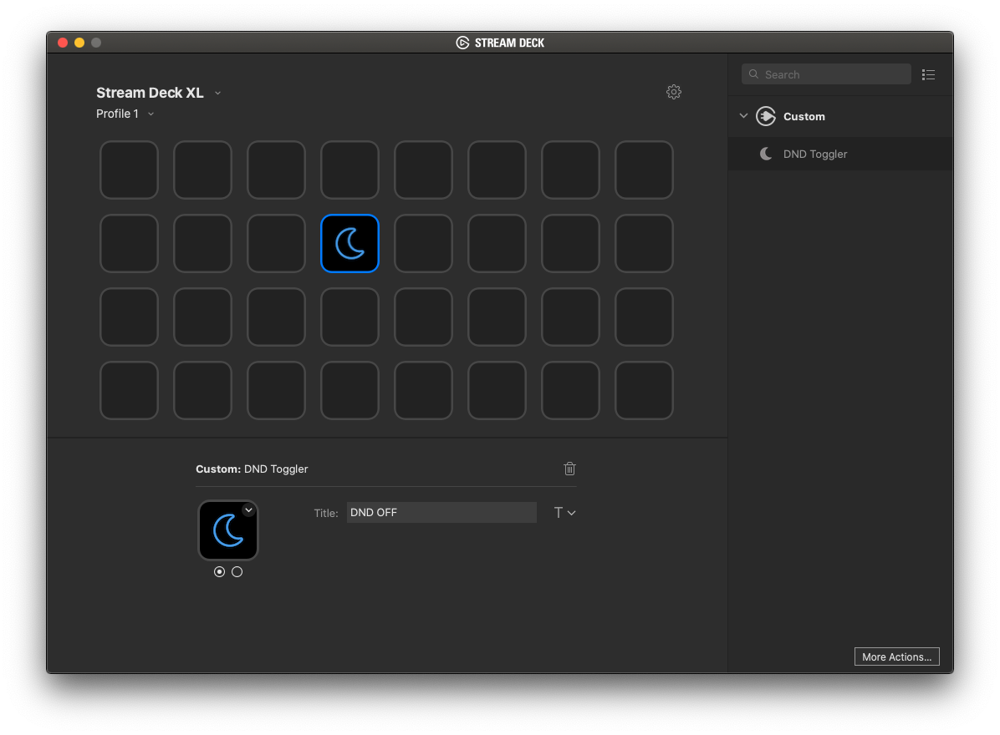

# DND Toggler plugin for Stream Deck

Plugin for [Stream Deck](https://www.elgato.com/gaming/stream-deck) written in Swift (macOS only).

# Description

`DND Toggler` lets you control macOS DND (Do not disturb) mode from your Stream Deck.

# Features

- Toggle DND status
- Provide a visual clue of the current DND status
- code written in Swift
- make use of Objective-C libraries
- macOS only

# Installation

In the release folder you can find the file `com.magobaol.dnd.streamDeckPlugin`: just download it and double click on it. You'll find it under the `Custom` group in your Stream Deck application.

# Known limitations

- The plugin is not compatible with Big Sur yet.
- If you toggle DND on your system, the new status won't be reflected on your Stream Deck until you switch page and go back to the one where the plugin is placed.

# About this plugin
There are lot of great Stream Deck plugins out there to control your Mac, like the [Airplane Mode](https://github.com/JarnoLeConte/streamdeck-airplanemode) or [AudioMute](https://github.com/fredemmott/StreamDeck-AudioMute), but there wasn't one to control DND.
I'm completely new to XCode, Swift and StreamDeck plugins development, but I found all the needed pieces and sewed them together. If it hadn't be for code by [Jarno Le Conté](https://github.com/JarnoLeConte) and [Sindre Sorhus](https://github.com/sindresorhus) this would have took me much longer.

# Source
If you want to compile the plugin by yourself, just clone the repo and open the project with XCode.
To build it for final release, download the [DistributionTool from Elgato](https://developer.elgato.com/documentation/stream-deck/sdk/exporting-your-plugin/) and place it under a `Release` folder at the same level of `Sources`.

# Credits

Implementation is based on the template [streamdeck-template-swift](https://github.com/JarnoLeConte/streamdeck-template-swift) by [Jarno Le Conté](https://github.com/JarnoLeConte).

Core DND functionalities are from [Sindre Sorhus](https://github.com/sindresorhus) in his NodeJS package [do-not-disturb](https://github.com/sindresorhus/do-not-disturb).

Icons by [Font Awesome](https://fontawesome.com/license)
